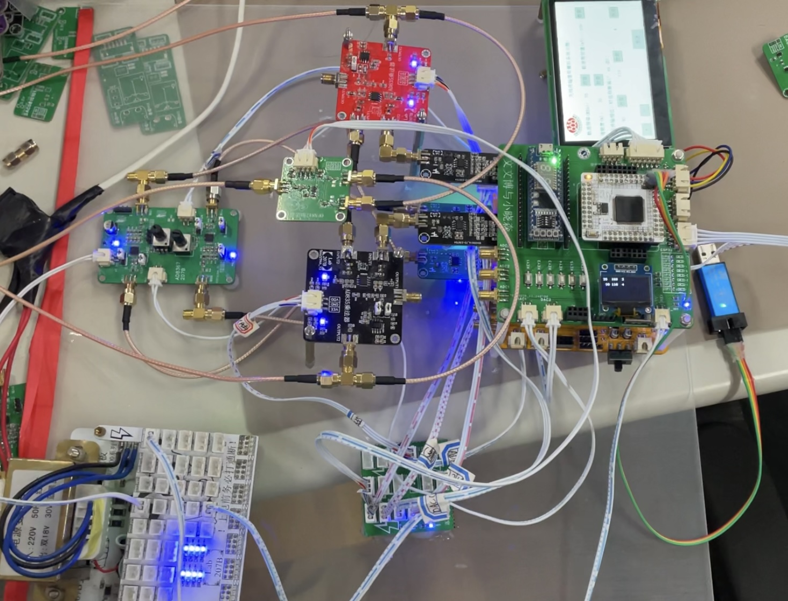
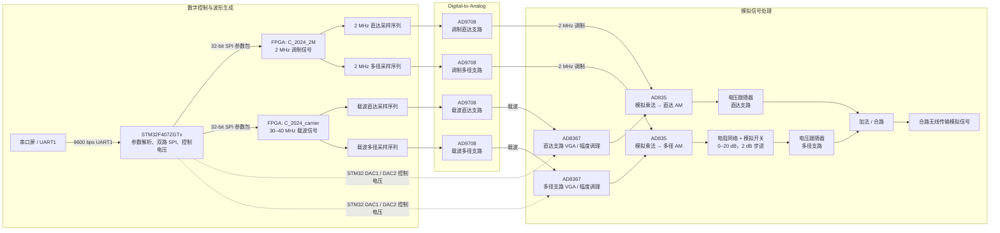
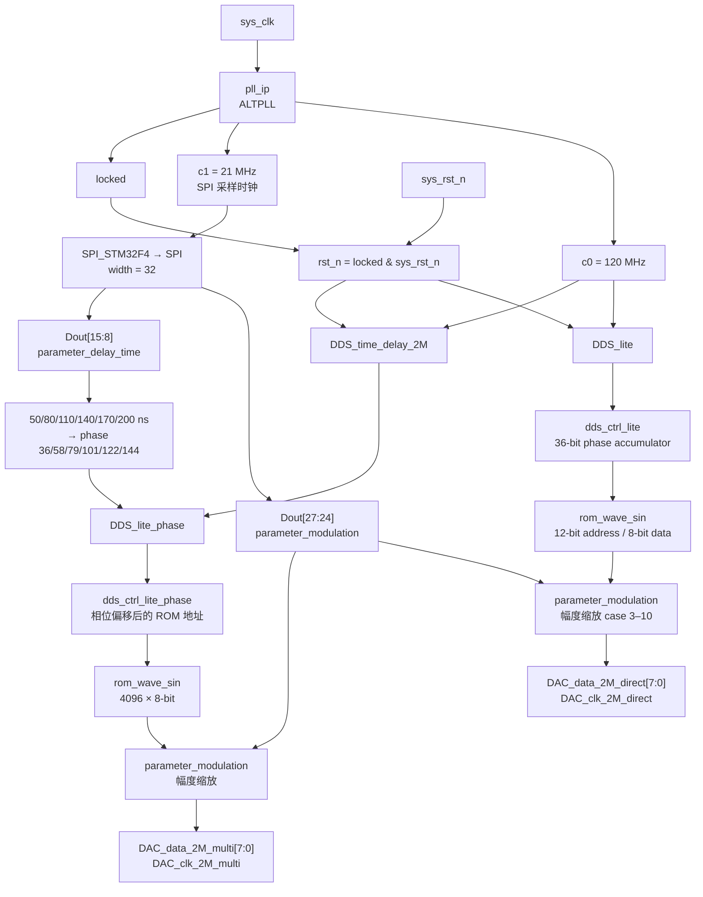
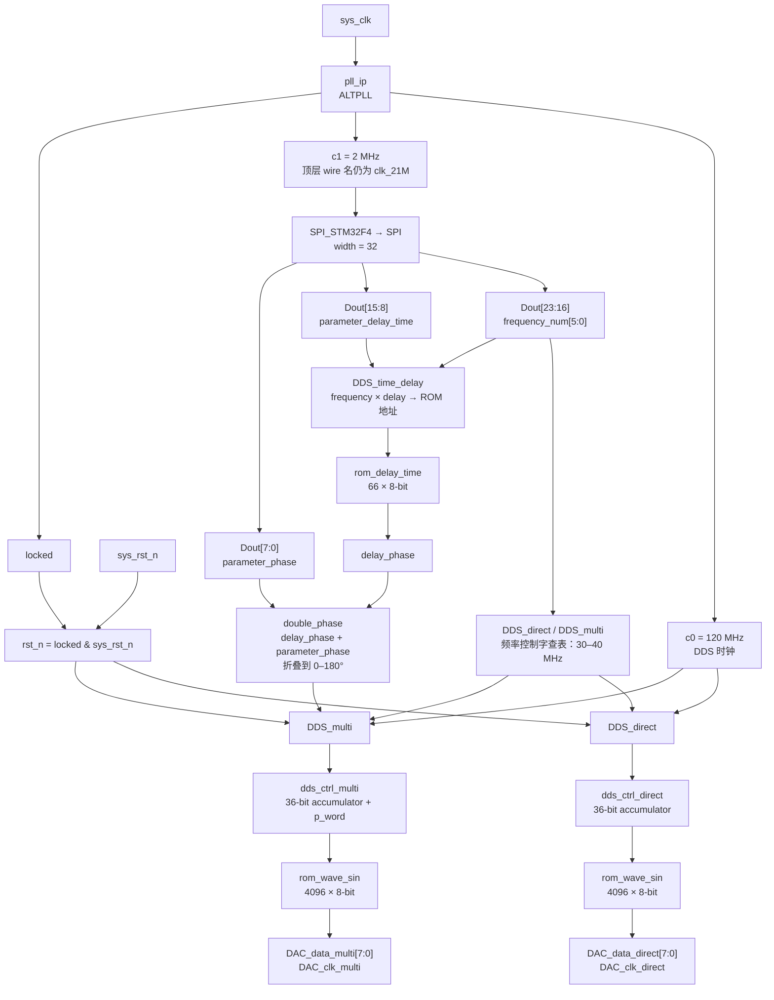

# 无线传输信号模拟系统

**Wireless Transmission Signal Simulation System**

> 2024 年江苏省大学生电子设计竞赛（TI 杯）C 题：无线传输信号模拟系统
>
> 项目成果：江苏省二等奖



图：系统实物与模拟信号链路搭建，图片保留自仓库中的 `c2.png`。

## 项目简介

本项目实现了一条由 `STM32F407`、双 `Intel MAX 10 FPGA`、`AD9708` 和模拟信号处理电路组成的无线传输信号模拟链路。系统将 **2 MHz 调制信号** 与 **30–40 MHz 载波信号** 分别在两个 FPGA 中实时生成，并为每类信号保留直达支路和多径支路；四路 DAC 将数字采样序列送入模拟域后，再由 `AD835` 完成 AM 乘法调制。

在模拟后端，多径支路经过电阻网络与模拟开关构成的衰减器，直达支路与衰减后的多径支路经电压跟随器隔离后合路，形成模拟的无线传输信号。`STM32F407` 负责串口屏参数接收、双路 FPGA 参数下发、幅度控制电压和辅助控制；FPGA 负责 DDS、相位/时延映射以及 DAC 数据输出。该项目展示的是数字波形生成与模拟调制、衰减、合路协同工作的混合信号系统，不将未在代码和报告中实现的噪声或完整 RF 衰落模型作为项目能力宣传。

## 项目亮点

- 两个独立的 `Quartus Prime 17.1` 工程分别承担 2 MHz 调制信号生成和 30–40 MHz 载波生成，顶层器件均为 `10M08SAM153C8GES`（`MAX 10`）。
- FPGA 内部使用 `PLL`、36-bit 相位累加器、12-bit ROM 地址和 `4096 × 8-bit` 正弦查找表生成 DAC 采样数据。
- `STM32F407ZGTx` 以 32-bit 数据包通过两路 bit-banged `SPI` 同时向两个 FPGA 下发调制度、载波频率、时延和相位参数。
- 每个 FPGA 暴露一组直达输出和一组多径输出，每组为 8-bit DAC 数据与 DAC clock；设计报告据此配置四路 `AD9708`。
- 采用 `AD835 ×2` 在模拟域完成两路 AM 乘法，避免把高频载波和调制信号直接在低速 FPGA/DAC 中数字相乘。
- `AD8367 ×2` 用作可控增益链路，STM32 片上双 DAC 输出控制电压；报告中的衰减器另由电阻网络和模拟开关实现 0–20 dB、2 dB 步进衰减。

## 系统总体架构



图中的直达/多径标识是功能分支标签，不代表板级器件丝印编号。报告确认了 `AD8367 ×2` 的数量和可控增益用途，当前 STM32 源码确认的是双 DAC 控制电压路径，未把它实现为带反馈检测的闭环 AGC。

## 系统分工

### STM32F407 系统控制

实际 Keil 工程目标器件为 `STM32F407ZGTx`，工程文件为 [`32代码/USER/chuxun.uvprojx`](./32代码/USER/chuxun.uvprojx)，主循环位于 [`32代码/USER/main.c`](./32代码/USER/main.c)。当前代码完成的系统控制链路包括：

- 初始化 `USART1/USART3/USART6`、按键、OLED、定时器、STM32 片上双 DAC、`TIM9` PWM 和两路 FPGA SPI GPIO；主参数接收路径使用 `USART1`，波特率为 `9600`。
- 从 `USART_RX_BUF1` 读取串口屏发送的 12-byte 缓冲区。当前主循环将 `fc`（载波频率）、`theta`（相位）、`alpha`、`ma`（调制度）、`Dtime`（时延）和 `Ac`（幅度相关参数）提取出来，并显示到 OLED。
- 按当前打包代码，送往 FPGA 的 32-bit 数据字段顺序为 `ma → fc → Dtime → theta`；随后调用 `spi_send32_down()` 和 `spi_send32_up()`，将同一组参数分别发送到两个 FPGA。
- `Ac_control1()` 根据 `Ac` 和 `fc` 查表，同时更新 STM32 `DAC_Channel_1` 与 `DAC_Channel_2`。设计报告将这两个控制电压用于调节 `AD8367` 增益，以满足载波有效值要求。
- 按键 1/2 调整 `DAC_Reset1()` / `DAC_Reset2()` 使用的增益控制值；按键 5/6 更新 `TIM9` 的两个 PWM compare 值。源码能够确认这些控制量存在，但没有在 C 代码中给出 PWM 到板级衰减器开关的明确网络命名。

### FPGA 数字信号生成

两个工程使用同一型号 `MAX 10` 器件，但具有明确不同的顶层输出命名：

- [`C_2024_2M`](./FPGA代码/C_2024_2M/C_2024_2M.qsf) 的顶层为 `C_2024_2M`，输出 `DAC_data_2M_direct` 与 `DAC_data_2M_multi`，负责两路 2 MHz 调制信号。
- [`C_2024_carrier`](./FPGA代码/C_2024_carrier/C_2024_carrier.qsf) 的顶层为 `C_2024_carrier`，输出 `DAC_data_direct` 与 `DAC_data_multi`，负责两路 30–40 MHz 载波信号。
- 两个顶层都使用 32-bit `SPI` 接收模块、`PLL` 产生 120 MHz DDS 时钟，并通过 `spi_start` / `spi_done` 对参数帧进行清除和使能。
- 每个顶层均输出两个 8-bit DAC 数据总线和两个 DAC clock；四路并行数字输出对应报告中的四路 `AD9708`。

### 模拟信号处理链

模拟部分对应设计报告第 3.1 节和图 3–6：

1. 两路 2 MHz 调制采样序列和两路载波采样序列分别经过四路 `AD9708`。
2. 载波支路经过两路 `AD8367` 可控增益放大器进行幅度调理；STM32 片上双 DAC 提供控制电压。
3. 每一路调制信号与对应载波进入一片 `AD835`，在模拟域相乘得到直达 AM 信号和多径 AM 信号。
4. 多径 AM 支路经过电阻网络与模拟开关组成的衰减器，报告给出的可调范围为 0–20 dB、2 dB 步进。
5. 直达支路和衰减后的多径支路经电压跟随器隔离后进入加法/合路电路，形成最终模拟输出。

## FPGA 数字逻辑设计

### `FPGA代码/C_2024_2M/`：2 MHz 调制信号 FPGA

#### 当前顶层数据流



#### RTL 事实

- `C_2024_2M.v` 实例化 `pll_ip`、`SPI_STM32F4`、`DDS_lite` 和 `DDS_time_delay_2M`。`DDS_time_delay_2M` 再实例化 `DDS_lite_phase`。
- `pll_ip.v` 的 `c0` 配置为 `120 MHz`、`c1` 配置为 `21 MHz`；`locked` 与外部低有效复位共同生成内部 `rst_n`。
- `dds_ctrl_lite.v` 使用 36-bit `frequency_add` 相位累加器，取 `frequency_add[35:24]` 作为 12-bit ROM 地址，输出 `rom_wave_sin` 的 8-bit 数据。
- 当前 `DDS_lite.v` 中的频率控制字为常量 `36'd1145324612`，对应工程命名和报告中的 2 MHz 调制信号；`parameter_modulation` 通过分支加法改变 DAC 采样幅度。
- 多径调制支路在 `DDS_time_delay_2M.v` 中把 50、80、110、140、170、200 ns 映射为离散相位值，再由 `dds_ctrl_lite_phase.v` 将相位字加入 ROM 地址。
- 当前顶层将 `SPI_STM32F4` 输出的 `parameter_frequency_num` 和 `parameter_phase` 留空，2 MHz 支路的频率不是由这两个字段实时设置；README 只将其表述为工程中实际存在的固定 2 MHz 调制信号。

### `FPGA代码/C_2024_carrier/`：30–40 MHz 载波 FPGA

#### 当前顶层数据流



#### RTL 事实

- `C_2024_carrier.v` 实例化 `pll_ip`、`SPI_STM32F4` 和 `DDS_time_delay`；`DDS_time_delay` 进一步实例化 `DDS_direct` 与 `DDS_multi`。
- `DDS_direct.v` 与 `DDS_multi.v` 对 `frequency_direct/frequency_multi` 做 30–40 MHz 的频率控制字查表，随后分别进入 `dds_ctrl_direct.v` 和 `dds_ctrl_multi.v`。
- `dds_ctrl_direct.v` 使用 36-bit 相位累加器与 12-bit 正弦 ROM 地址；`dds_ctrl_multi.v` 在同一频率控制基础上将 `p_word` 加到 ROM 地址，生成多径载波相位。
- `DDS_time_delay.v` 使用 `parameter_frequency_num` 和 `parameter_delay_time` 访问 `rom_delay_time`，再把查表得到的 `delay_phase` 与 `parameter_phase` 合成为多径载波的相位控制量。
- `C_2024_carrier/ip/pll/pll_ip.v` 的第二路 PLL 输出实际配置为 `2 MHz`，虽然顶层信号名仍为 `clk_21M`；因此 README 按 IP 实际配置描述，不按变量名猜测时钟频率。

### RTL 模块结构

以下只列出两个 Quartus `.qsf` 实际加入工程的关键 RTL/IP，未把 `db/`、`incremental_db/`、`output_files/` 等 generated files 当作设计模块：

```text
FPGA代码/
├── C_2024_2M/
│   ├── C_2024_2M.qpf
│   ├── C_2024_2M.qsf
│   ├── rtl/
│   │   ├── TOP/C_2024_2M.v
│   │   ├── DDS/DDS_time_delay_2M.v
│   │   ├── DDS/DDS_lite.v
│   │   ├── DDS/DDS_lite_phase.v
│   │   ├── DDS/dds_ctrl_lite.v
│   │   ├── DDS/dds_ctrl_lite_phase.v
│   │   └── SPI/SPI_STM32F4.v + SPI.v
│   └── ip/
│       ├── pll/pll_ip.v + pll_ip.qip
│       └── rom/rom_wave_sin.v + sin_2M.mif
└── C_2024_carrier/
    ├── C_2024_carrier.qpf
    ├── C_2024_carrier.qsf
    ├── rtl/
    │   ├── TOP/C_2024_carrier.v
    │   ├── TOP/DDS_time_delay.v
    │   ├── DDS/DDS_direct.v
    │   ├── DDS/DDS_multi.v
    │   ├── DDS/dds_ctrl_direct.v
    │   ├── DDS/dds_ctrl_multi.v
    │   └── SPI/SPI_STM32F4.v + SPI.v
    └── ip/
        ├── pll/pll_ip.v + pll_ip.qip
        └── rom/rom_wave_sin.v + rom_delay_time.v
```

## 信号生成与 AM 调制

### 数字域

数字域将调制信号和载波信号拆分到两个 FPGA：

- `C_2024_2M` 的直达支路和多径支路均为 2 MHz 正弦采样序列；`DDS_lite` 直接生成一支，`DDS_lite_phase` 生成带离散相位偏移的另一支。
- `C_2024_carrier` 的直达支路和多径支路均为 30–40 MHz 载波采样序列；`DDS_direct` 和 `DDS_multi` 共用频率控制字，但多径支路叠加由时延查表得到的相位。
- 两类 FPGA 输出均为 8-bit DAC 数据并带独立 DAC clock；FPGA 本身不包含 AD835 的模拟乘法器模型。

### 模拟域

设计报告第 1.3 节明确选择“FPGA 驱动四路 `AD9708`，再通过模拟乘法器相乘”的方案，而不是在 FPGA 内直接进行高频数字乘法。实际链路为：

```text
2 MHz 调制采样序列 ──AD9708──┐
                              ├── AD835 ── AM 直达 / 多径信号
30–40 MHz 载波采样序列 ─AD9708─┘
```

两条支路分别使用一片 `AD835`。调制度由 2 MHz 调制信号的数字幅度参数影响，载波有效值则由 STM32 双 DAC 与 `AD8367` 可控增益链路配合调节。

## 多径与传输条件模拟

当前工程和设计报告能够共同确认的“传输条件”包括：

- **时延**：系统参数选项为 50、80、110、140、170、200 ns。2 MHz FPGA 将这些值映射为调制支路相位，载波 FPGA 通过 `rom_delay_time.mif` 按载波频率和时延查表得到相位。
- **相对相位**：载波 FPGA 将查表相位与 `parameter_phase` 合成多径载波的相位控制字；2 MHz FPGA 的当前顶层没有把 `parameter_phase` 接入其 `DDS_lite_phase` 实例。
- **幅度衰减**：设计报告给出的多径衰减器范围为 0–20 dB、2 dB 步进，使用电阻网络和模拟开关；它属于模拟硬件信号链，不是 FPGA 内的噪声或衰落算法。
- **合路**：直达 AM 与衰减后的多径 AM 经过电压跟随器隔离后进入加法/合路电路。

仓库中没有找到 `LFSR`、`PRBS`、Gaussian-like noise generator 或明确的 SNR 计算/控制路径，因此本项目页不把“噪声注入”“SNR 可调”“多径衰落仿真”写成已实现功能；这里的多径模拟具体指报告和 RTL 已实现的时延、相位与幅度衰减支路。

## 人机交互与参数控制

设计报告将串口屏作为人机交互入口，STM32 源码中的 `HMI` 驱动通过 `USART1` 发送串口屏命令，`main.c` 通过 `USART1_IRQHandler` 接收参数帧，并在 OLED 上显示当前参数。

当前主循环的有效参数路径如下：

| 参数 | STM32 当前代码路径 | FPGA / 模拟链路作用 |
| --- | --- | --- |
| `fc` | UART1 接收 → 32-bit SPI 数据包 | `C_2024_carrier` 的 30–40 MHz 频率控制字 |
| `theta` | UART1 接收 → 32-bit SPI 数据包 | 载波多径支路的相位参数 |
| `Dtime` | UART1 接收 → 32-bit SPI 数据包 | 两个 FPGA 的多径时延参数 |
| `ma` | UART1 接收 → 32-bit SPI 数据包 | `C_2024_2M` 的调制幅度/调制度分支选择 |
| `Ac` | UART1 接收 → `Ac_control1()` → STM32 DAC1/DAC2 | `AD8367` 可控增益链路的控制电压 |
| `alpha` | UART1 接收并显示在 OLED | 当前 `main.c` 中 `PWMconDC(alpha)` 调用被注释；不能据此宣称串口屏已完成衰减器闭环配置 |

`HMI_mode()` 中还保留了 `CW`、`AM`、`ASK`、`PSK`、`FSK`、`FM` 等界面标签，但当前 `main.c` 没有调用该函数，FPGA 当前活动数据路径也只支持本项目已核实的 AM 信号生成链路；因此本 README 不将这些标签扩展为已验证的调制制式。

## 测试与结果

以下为设计报告第 4 章和附录中记录的测试内容，不代表本次 README 维护重新进行了硬件测试：

- 测试仪器：`RIGOL DG5252` 信号发生器、`ZDS1104` 示波器、固纬 `GDM-8261A` 数字万用表。
- 载波测试覆盖 30–40 MHz 频率档位；报告表 2 记录了 30–39 MHz 档位的约 104.2–1000.6 mV 幅值测量值，40 MHz 行保留为频率档位记录。
- AM 调制度测试表覆盖多组载波频率和调制度设置，报告记录值约为 29%–91% 的范围。
- 多径测试覆盖 50–200 ns 时延、相位差和 0–20 dB 衰减档位；报告结论为直达/多径信号能够输出、合路波形稳定并达到题目要求。

## 核心器件与开发环境

| 子系统 | 实现与依据 |
| --- | --- |
| 系统控制 | `STM32F407ZGTx`；Keil/MDK 工程 `32代码/USER/chuxun.uvprojx` |
| FPGA | 2 × `Intel MAX 10 10M08SAM153C8GES`；两个 Quartus 工程的 `.qsf` 均明确指定该器件 |
| FPGA 开发 | `Quartus Prime 17.1`、Verilog HDL、`ALTPLL`、`altsyncram` ROM IP |
| 调制信号源 | `C_2024_2M`：两路 2 MHz、8-bit DAC 数据输出 |
| 载波信号源 | `C_2024_carrier`：两路 30–40 MHz、8-bit DAC 数据输出 |
| D/A | 4 × `AD9708`；设计报告图 3/第 3.1.1 节确认四路 DAC，两个 FPGA 顶层各提供两组数据/clock 接口 |
| 模拟乘法 | 2 × `AD835`；分别生成直达 AM 与多径 AM |
| 可控增益 | 2 × `AD8367`；报告称可控增益放大器，STM32 双 DAC 提供控制电压 |
| 多径衰减 | 电阻网络 + 模拟开关，0–20 dB，2 dB 步进 |
| 人机交互 | 串口屏 / `USART1`，并使用板端 OLED 显示参数 |
| 辅助控制 | STM32 `TIM9` 双通道 PWM、按键和状态指示 LED |

## 软件与工程结构

```text
.
├── FPGA代码/
│   ├── C_2024_2M/
│   └── C_2024_carrier/
├── 32代码/
│   ├── USER/       # STM32F407 Keil 工程与 main.c
│   ├── HARDWARE/   # DAC、FPGA_SPI、HMI、PWM、OLED 等驱动
│   ├── SYSTEM/     # delay、timer、usart、sys
│   ├── CORE/
│   └── FWLIB/
├── 设计报告/
│   └── C_ZJ004_张瀚文_张力文_沈子杰.pdf
├── c2.png
├── README.md
└── LICENSE
```

`FPGA代码/` 下的 `db/`、`incremental_db/`、`output_files/`、`greybox_tmp/` 和仿真文件属于原 Quartus 工程随附内容，本次 README 只解释其工程入口和 RTL 层次，不对这些历史 generated files 做清理或改名。

## 设计报告

[查看完整设计报告：C_ZJ004_张瀚文_张力文_沈子杰.pdf](./设计报告/C_ZJ004_张瀚文_张力文_沈子杰.pdf)

报告封面给出的正式题目信息为：**2024 年江苏省大学生电子设计竞赛（TI 杯）C 题——无线传输信号模拟系统**。报告中与本 README 架构对应的重点章节为：

- 第 1 章：系统方案论证，包括 `STM32 + MAX10 FPGA`、模拟 AM 调制和衰减器方案选择；
- 第 2.2 节：多径传输信号的时延、相位和衰减分析；
- 第 3.1 节：总体框图、`AD8367`、衰减器、`AD835` 模拟乘法器电路；
- 第 3.2 节：STM32、SPI、DDS、DAC 输出的软件/程序设计思路；
- 第 4 章及附录：测试方法、测试仪器和测试结果。

## 项目成果

- 2024 年江苏省大学生电子设计竞赛（TI 杯）；
- C 题“无线传输信号模拟系统”；
- 江苏省二等奖。

## License

本项目遵循 [MIT License](./LICENSE)。
